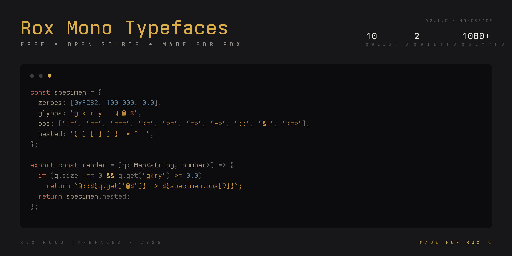
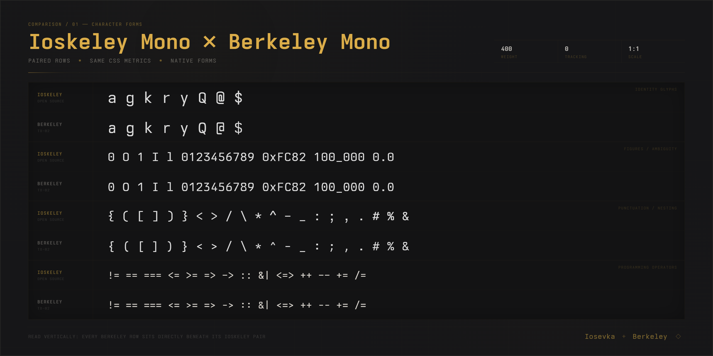

# Ioskeley Mono

<p align="center">
  
</p>

<p align="center">
  <a href="https://github.com/ahatem/IoskeleyMono/releases/latest"></a>
  <a href="https://github.com/ahatem/IoskeleyMono/releases"></a>
  <a href="./LICENSE"></a>
  <a href="https://ahatem.github.io/IoskeleyMono/"></a>
</p>

<p align="center">
  <strong>Компактная геометрическая программная гарнитура, созданная на основе Iosevka.</strong><br>
  Настроена для редакторов, терминалов и веба. Вдохновлена характером Berkeley Mono.
</p>

<p align="center">
  <a href="https://ahatem.github.io/IoskeleyMono/"><strong>Открыть онлайн-демонстрацию</strong></a>
  &nbsp;·&nbsp;
  <a href="https://github.com/ahatem/IoskeleyMono/releases/latest"><strong>Скачать последнюю версию</strong></a>
</p>

<p align="center">
  <sub>Ioskeley Mono бесплатен. Звёзды репозиторию, ваши примеры настроек, отчёты об ошибках и вклад в развитие — всё это помогает проекту расти.</sub>
</p>

<p align="center">
  <a href="#загрузки-и-варианты">Загрузки</a> ·
  <a href="#дизайн">Дизайн</a> ·
  <a href="#установка">Установка</a> ·
  <a href="#настройка-редактора">Настройка</a> ·
  <a href="#сборка-из-исходников">Сборка</a>
</p>

---

## Загрузки и варианты

Не знаете, какой файл выбрать? Начните с **[`IoskeleyMono.zip`](https://github.com/ahatem/IoskeleyMono/releases/latest/download/IoskeleyMono.zip)** для редактора или **[`IoskeleyMono-Term.zip`](https://github.com/ahatem/IoskeleyMono/releases/latest/download/IoskeleyMono-Term.zip)** для терминала.

| Пакет | Лучше всего подходит | Лигатуры | Иконки Nerd Font |
|---|---|:---:|:---:|
| **[`IoskeleyMono.zip`](https://github.com/ahatem/IoskeleyMono/releases/latest/download/IoskeleyMono.zip)** | VS Code, JetBrains IDEs, Zed, Sublime Text, Cursor | Да | Нет |
| **[`IoskeleyMono-NerdFont.zip`](https://github.com/ahatem/IoskeleyMono/releases/latest/download/IoskeleyMono-NerdFont.zip)** | Редакторы, которым нужны патченые символы и иконки | Да | Да |
| **[`IoskeleyMono-Term.zip`](https://github.com/ahatem/IoskeleyMono/releases/latest/download/IoskeleyMono-Term.zip)** | Kitty, Ghostty, WezTerm, Alacritty | Да | Нет |
| **[`IoskeleyMono-Term-NerdFont.zip`](https://github.com/ahatem/IoskeleyMono/releases/latest/download/IoskeleyMono-Term-NerdFont.zip)** | Терминалы, промпты и консольные редакторы, которым нужны иконки | Да | Да |
| **[`IoskeleyMono-NL.zip`](https://github.com/ahatem/IoskeleyMono/releases/latest/download/IoskeleyMono-NL.zip)** | Приложения, в которых нельзя отключить лигатуры, включая Xcode | Нет | Нет |
| **[`IoskeleyMono-NL-NerdFont.zip`](https://github.com/ahatem/IoskeleyMono/releases/latest/download/IoskeleyMono-NL-NerdFont.zip)** | Семейство без лигатур с патчеными символами и иконками | Нет | Да |
| **[`IoskeleyMono-Web.zip`](https://github.com/ahatem/IoskeleyMono/releases/latest/download/IoskeleyMono-Web.zip)** | Сайты с латинским текстом, пунктуацией, стрелками, математикой или блочной графикой | Да | Нет |
| **[`IoskeleyMono-Web-Full.zip`](https://github.com/ahatem/IoskeleyMono/releases/latest/download/IoskeleyMono-Web-Full.zip)** | Сайты, которым нужен полный набор глифов десктопной версии | Да | Нет |

> [!TIP]
> **Работаете в терминале?** Выберите пакет `Term`. Его метрики сохраняют стрелки и символы блочной графики внутри своих ячеек.
>
> **Делаете сайт?** Начните с `IoskeleyMono-Web.zip`. Выбирайте `Web-Full` только если нужны греческий алфавит, кириллица, длинные стрелки или редкие математические символы. Оба веб-архива используют одинаковые имена файлов, поэтому для переключения между ними не нужны новые правила `@font-face`.

### Выберите ширину

| Ширина | Относительная ширина | Выбирайте, если |
|---|:---:|---|
| **Normal** | 100% | Нужен баланс между плотностью и читаемостью по умолчанию |
| **SemiCondensed** | 90% | Нужно уместить больше кода в строке, не меняя общий дизайн |

### Выберите вариант рендеринга

| Дисплей | Папка |
|---|---|
| Windows или Linux на дисплее со стандартной плотностью пикселей | **Hinted** |
| macOS или любой HiDPI-дисплей | **Unhinted** |

Устанавливайте один вариант рендеринга для каждой ширины, чтобы избежать дублирования записей шрифтов. У пакетов Nerd Font нет отдельных копий Hinted и Unhinted.

<details>
<summary><strong>Посмотреть структуру папок пакета</strong></summary>

```text
Normal/
  Hinted/
  Unhinted/
SemiCondensed/
  Hinted/
  Unhinted/
```

</details>

## Краткий обзор

- **40 статических начертаний:** 10 толщин × 2 ширины × прямой и курсив.
- **Выразительные формы глифов:** нуль с точкой, одинарная `g`, открытые `6` и `9`, восьмёрка из двух окружностей `8`, скобки с пологой дугой, приподнятое подчёркивание и квадратные точки в знаках препинания.
- **Программные лигатуры:** включены в стандартных семействах, Term и web; для случаев, когда лигатуры должны оставаться выключенными, есть отдельные сборки NL.
- **Опциональный перечёркнутый нуль:** включите функцию OpenType `zero` в приложениях, которые её поддерживают.
- **Специализированные пакеты:** релизный workflow создаёт варианты для обычных десктопных приложений, терминалов, Nerd Font, без лигатур и для веба.

## Дизайн

Ioskeley Mono — не готовая сборка Iosevka. Его [план сборки](./private-build-plans.toml) определяет формы глифов, ширины, наклоны, межсимвольные интервалы и вертикальные метрики, используемые во всём семействе.

В дизайне уравновешены три идеи:

- **Компактный ритм** — плотная, но читаемая текстура, позволяющая держать в поле зрения больше кода.
- **Геометрическая ясность** — прямые формы, квадратные детали и намеренно различающиеся цифры.
- **Полноценное рабочее семейство** — единая система форм в двух ширинах, десяти толщинах, курсивах, для терминалов и веба.

### Сравнение деталей

Ниже показано, как глифы Ioskeley Mono соотносятся с глифами Berkeley Mono и чем две гарнитуры различаются.

#### Формы знаков

Сравнение цифр, пунктуации, скобок и распространённых программных знаков.



#### Наложение

Наложение глифов друг на друга для проверки базовых линий, пропорций, общих областей и заметных различий контуров.


#### Плотность кода

Образец реального кода, сравнивающий ритм строк, интервалы и визуальный вес в редакторе.


## Толщины

Каждая толщина доступна в обеих ширинах, в прямом и курсивном начертании.

| Толщина | CSS `font-weight` | Прямой | Курсив |
|---|---:|:---:|:---:|
| Thin | `100` | Есть | Есть |
| ExtraLight | `200` | Есть | Есть |
| Light | `300` | Есть | Есть |
| SemiLight | `350` | Есть | Есть |
| Regular | `400` | Есть | Есть |
| Medium | `500` | Есть | Есть |
| SemiBold | `600` | Есть | Есть |
| Bold | `700` | Есть | Есть |
| ExtraBold | `800` | Есть | Есть |
| Black | `900` | Есть | Есть |

## Установка

### Менеджеры пакетов

| Система | Пакет | Установка |
|---|---|---|
| macOS | [Homebrew](https://formulae.brew.sh/cask/font-ioskeley-mono) | `brew install --cask font-ioskeley-mono` |
| Nix / NixOS | [nixpkgs](https://github.com/NixOS/nixpkgs/tree/master/pkgs/data/fonts/ioskeley-mono) | `nix profile install nixpkgs#ioskeley-mono.normal` |
| Arch Linux | [AUR](https://aur.archlinux.org/packages/ttf-ioskeley-mono) | Пакет: `ttf-ioskeley-mono` |
| Slackware | [SlackBuilds.org](https://slackbuilds.org/repository/15.0/system/IoskeleyMono/) | Пакет: `IoskeleyMono` |

> [!NOTE]
> Репозитории пакетов обновляются по собственному расписанию и не всегда содержат последний выпуск Ioskeley. Страница [GitHub Releases](https://github.com/ahatem/IoskeleyMono/releases/latest) — источник актуальных сборок и всех доступных вариантов.

Спасибо [@zhimoe](https://github.com/zhimoe), [@ForsakenHarmony](https://github.com/ForsakenHarmony) и [@frovere](https://github.com/frovere) за помощь с публикацией в Homebrew.

### Ручная установка

- **macOS:** Распакуйте архив, выберите файлы `.ttf` из папки нужной ширины и варианта рендеринга, откройте их в приложении Font Book и нажмите **Установить**.
- **Windows:** Распакуйте архив, выберите файлы `.ttf`, щёлкните по ним правой кнопкой и выберите **Install for all users** («Установить для всех пользователей»).
- **Linux:** Скопируйте выбранные файлы `.ttf` в `~/.local/share/fonts/IoskeleyMono/`, затем выполните `fc-cache -fv`.

После установки перезапустите открытые приложения, чтобы они обновили списки шрифтов.

## Настройка редактора

Используйте имя семейства, соответствующее установленному пакету.

| Пакет | Гарнитура |
|---|---|
| Standard | `Ioskeley Mono` |
| Standard Nerd Font | `IoskeleyMono Nerd Font Mono` |
| Term | `Ioskeley Mono Term` |
| Term Nerd Font | `IoskeleyMonoTerm Nerd Font Mono` |
| No Ligatures | `Ioskeley Mono NL` |
| No Ligatures Nerd Font | `IoskeleyMonoNL Nerd Font Mono` |

### VS Code / Cursor

```json
{
  "editor.fontFamily": "'Ioskeley Mono', monospace",
  "editor.fontLigatures": true,
  "editor.fontWeight": "400",
  "editor.fontSize": 14.5,
  "editor.lineHeight": 1.55
}
```

### Zed

```json
{
  "buffer_font_family": "Ioskeley Mono",
  "buffer_font_size": 15,
  "buffer_line_height": "comfortable"
}
```

### Ghostty

```ini
font-family = Ioskeley Mono Term
font-size = 14
```

### Alacritty

```toml
[font.normal]
family = "Ioskeley Mono Term"
style = "Regular"
```

### Kitty

```conf
font_family      Ioskeley Mono Term
bold_font        auto
italic_font      auto
bold_italic_font auto
font_size        14.0
```

## Возможности OpenType

Ioskeley Mono поддерживает функции OpenType, которые совместимые приложения могут включать и отключать.

| Функция | Действие |
|---|---|
| `zero` | Перечёркнутый нуль вместо нуля с точкой по умолчанию |
| `calt` | Контекстные программные лигатуры. По умолчанию включены там, где поддерживаются |
| `dlig` | Дискреционные лигатуры |
| `onum` | Старые цифры (old-style figures) |
| `frac` | Оформление дробей |

```jsonc
// VS Code / Cursor
"editor.fontLigatures": "'calt', 'zero'"
```

```ini
# Ghostty
font-feature = zero
```

```conf
# Kitty
font_features IoskeleyMonoTerm +zero
```

```css
/* CSS */
font-feature-settings: "zero";
```

## Сборка из исходников

Релизные сборки создаются с помощью [GitHub Actions](.github/workflows/build-font.yml). Текущий workflow закрепляет Iosevka `v34.4.0`, поэтому тегированные выпуски остаются воспроизводимыми.

```bash
# Clone the project and the pinned Iosevka source
git clone https://github.com/ahatem/IoskeleyMono.git
git clone --branch v34.4.0 --depth 1 https://github.com/be5invis/Iosevka.git

# Copy the custom build plan
cp IoskeleyMono/private-build-plans.toml Iosevka/

# Install dependencies and build every family
cd Iosevka
npm install
npm run build -- contents::IoskeleyMono contents::IoskeleyMonoTerm contents::IoskeleyMonoNL contents::IoskeleyMonoWeb
```

Скомпилированные файлы записываются в `Iosevka/dist/<PlanName>/`. Релизный workflow также создаёт варианты с хинтингом, Nerd Font и упакованные архивы для скачивания.
